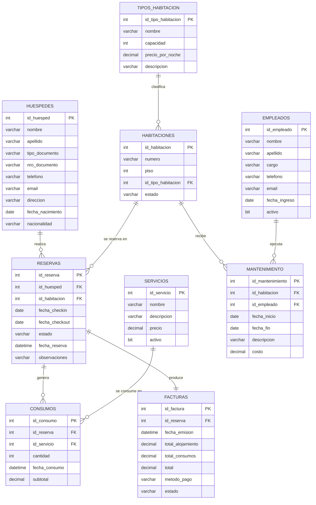

# Diagrama de Entidad-Relación (DER) — Sistema HotelDB

## Diagrama en notación Mermaid

## Lectura del Diagrama

### Entidades (9 en total)

1. **HUESPEDES** — Personas que se alojan en el hotel.
2. **TIPOS_HABITACION** — Categorías de habitaciones (Single, Doble, Suite, etc.).
3. **HABITACIONES** — Habitaciones físicas del hotel.
4. **RESERVAS** — Registros de estadías planificadas o en curso.
5. **SERVICIOS** — Catálogo de servicios adicionales (Minibar, Spa, etc.).
6. **CONSUMOS** — Registros individuales de servicios utilizados por huéspedes.
7. **FACTURAS** — Comprobantes de pago emitidos al finalizar una estadía.
8. **EMPLEADOS** — Personal del hotel.
9. **MANTENIMIENTO** — Tareas de mantenimiento realizadas en habitaciones.

### Relaciones y Cardinalidades

| #   | Entidad Origen   | Cardinalidad | Entidad Destino | Verbo                                       |
| --- | ---------------- | ------------ | --------------- | ------------------------------------------- |
| 1   | TIPOS_HABITACION | 1:N          | HABITACIONES    | Un tipo clasifica muchas habitaciones       |
| 2   | HUESPEDES        | 1:N          | RESERVAS        | Un huésped realiza muchas reservas          |
| 3   | HABITACIONES     | 1:N          | RESERVAS        | Una habitación se reserva muchas veces      |
| 4   | RESERVAS         | 1:N          | CONSUMOS        | Una reserva genera muchos consumos          |
| 5   | SERVICIOS        | 1:N          | CONSUMOS        | Un servicio se consume muchas veces         |
| 6   | RESERVAS         | 1:1          | FACTURAS        | Una reserva produce una factura             |
| 7   | HABITACIONES     | 1:N          | MANTENIMIENTO   | Una habitación recibe muchos mantenimientos |
| 8   | EMPLEADOS        | 1:N          | MANTENIMIENTO   | Un empleado ejecuta muchos mantenimientos   |

### Claves Foráneas (FK)

| Tabla Hija    | Columna FK         | Referencia (Tabla.PK)               |
| ------------- | ------------------ | ----------------------------------- |
| HABITACIONES  | id_tipo_habitacion | TIPOS_HABITACION.id_tipo_habitacion |
| RESERVAS      | id_huesped         | HUESPEDES.id_huesped                |
| RESERVAS      | id_habitacion      | HABITACIONES.id_habitacion          |
| CONSUMOS      | id_reserva         | RESERVAS.id_reserva                 |
| CONSUMOS      | id_servicio        | SERVICIOS.id_servicio               |
| FACTURAS      | id_reserva         | RESERVAS.id_reserva                 |
| MANTENIMIENTO | id_habitacion      | HABITACIONES.id_habitacion          |
| MANTENIMIENTO | id_empleado        | EMPLEADOS.id_empleado               |

